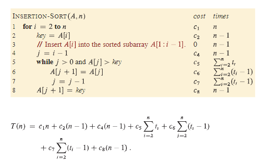
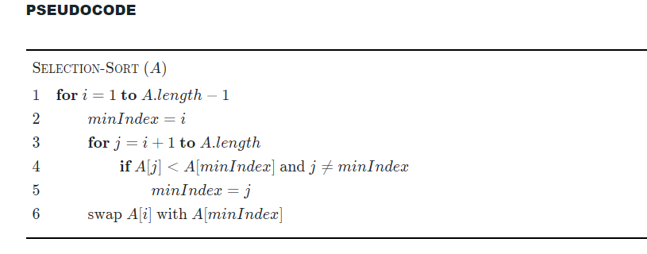

# 2.1
numbers to be sorted are also known as keys-
input comes in the form of an array
keys associated with other data is called satellite data
keys + satallite data form a record

Insertion-Sort(A,n)
for i = 2 to n
    key = A[i]
    // Insert A[i] into the sorted subarrary A[1:1-1]
    j = i-1
    while j > 0 and A[j] > key
        A[j + 1] = A[j]
        j = j - 1
        A[j+1] = key

loop invariants help us understand why an algorith is correct. When you're using a loop invariant you need to show three things:

initialization - It is true prior to the first iteration of the loop

Maintenance - if it is true before an iteration of the loop, it remains true before the next iteration.

Termination - The loop terminates, and when it terminates, the invariant usually along with the reason that the loop terminated gives us a useful property that helps show that the algorithm is correct 

when the first two properties hold ( initialization & Maintenance ) the loop invariant is true prior to every iteration of the loop. 

a loop-invariant proof is a form of mathematical induction, where to prove that a property holds you, prove a base case and an inductive step. 

Termination is the most "important" since loop invariant is used to show correctness. use loop invariant along wiht the condition that caused the loop to terminate 

mathematical induction typically applies the inductive step infinitely, but in a loop invariant the induction stops when the loop terminates

intialization property for insertion sort
We start  by showing  that the loop  invariant  holds  before  the first 
loop iteration, when i = 2^2 The subarrary A[1:i-1] consists of just the singel element A[1] which is in fact the original element in A[1]

Maintenance property for insertion sort 
each loop maintains the loop invariant by moving the values 
A[i-1], A[i-2], A[i-3], etc moves one position to the right until it finds the proper position for A[i] at which point it insert the value of A[i]

Termination property for insertion sort
the loop variable i starts at 2 and increases by 1 in each iteration. once i's value exceeds n in line 1 the loop terminates. 
the loop terminates once i equales n + 1. substituting n + 1 for i  in the loop invariant yields that the subaarray A[1:n] consists of the elements originally in A[1:n] but in sorted order. that means the algorithm is correct.

organize compound data into objects, which are composed of attributes.
attributes are access using the syntax found in many object-oriented programming languages. object name followed by a dot followed by the attribute name. example object x has attribute f, we denote this attribute by x.f.

pass paramenters to a procedure by value.

a return statement immediatelly transfers control back to the point of call in the calling procedure. most return statements also take a value to pass back to the caller. 

the boolean operators "and" and "or" are short circuiting. they evaluate the expression x and y by first evaluating x. If x evaluates to false, then the entire expression cannot evaluate to True and therefore y is not evaluated. 

state a loop invariant for this procedure using initialization, Maintenance and Termination properties

sum-array(A,n)
    sum = 0
    for i = 1 to n
        sum = sum + A[i]
    return sum

# 2.2 analyzing algorithms
 analyzing an algorithm has come to mean predicting the resources that the algorithm requires
resources can be
- memory
- communication 
- bandwidth
- energy consumption
Data types in RAM model are
- integer
- floating point
- character
The running time of an algorithm on a particular input is the number of instructions and data accesses excuted 



for inputs of a given size, an algorithms running time may depend on which input of that size is given. 

# Exercises
express the function n^3/1000 + 100n^2 - 100n +3 in terms of (theta) - notation 
answer 
 
 ```
 (2) applied repeatedly tells us Θ(e) = Θ(max(n^3/1000 - 100n^2 - 100n + 3))
 Applying rule (1) to each of these, this will equal Θ(max(n^3, n^2, n, 1))
 Now we can apply rule (4) to see that Θ(1) < Θ(n) < Θ(n^2) < Θ(n^3):
 So Θ(max(n^3, n^2, n, 1)) = Θ(n^3)
 ```

Consider sorting n  numbers stored in array A[1:n] by  first  finding  the  smallest element of A[1:n] and exchanging it with the element in A[1].  Then  find  the smallest element of  A[2:n] and exchange it with A[2].  Then  find  the  smallest element of A[3:n], and exchange it with A[3].  Continue in this manner for the first n - 1 elements of A.  Write pseudocode for this algorithm, which is known 
as selection sort.  What loop invariant does this algorithm maintain?  Why does  it 
need to run for only the first n - 1 elements, rather than for all n elements?  Give the worst-case  running  time of  selection  sort  in  ‚-notation.  Is  the  best-case  running  time any better?
 


Algorithm needs to run for only the first n - 1 elements rather then for all n elements because the last iteration will compare A[n] with the minimum elenet in A[1..n - 1] in line 4 and swap if necessary. Since that happens there is no need to continue the algorithm for all the way to the last element. 

How can you modify any sorting algorithm to have a good best-case running time
```
reverse the sorting algorithm
modify any algorithm to have a best case time complexity of 0(n) by adding a special case, that if the input matches theis special case- return a  cached hard cooded answer
```

# 2.3 Designing Algorithms 