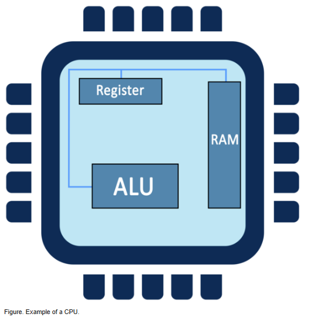

## CPU
    the Central Process Unit(CPU) is the electronic circuit responsible for excecuting computer program instructions. The Cpu consists of three parts
    1 - the arithetic logic unit (AlU) which contains circuitry that performs operations on data such as addition and subtraction
    2 - the control unit, which contains the circuitry coordinating the machines's activiteis and 
    3 - the processor register, whick contains data storage cell called registers. 
    transfers - the data from the main memory into the registers 
    informs - the ALU which registers hold the data
    activates - the ALU and 
    tell - the ALU which register should receive the result

## Ram
    the memory unit consists of random- access memory (ram), sometimes referred to as primary or main memory. unlike a hard drive (permanent memory, seconday memory) this memory is fast and directly accessible by the CPU. loading data from secondary to primary memory allows the cpu to operate faster. However, Ram is ephemeral, meaning data stored in ram is lost when the computer is powered off. 
    ram is split into partitions, Each partition consits of an address and its contents, all in binary form. The address uniquely identifies every location in the memory
    In addition to ram, read-only memory (Rom) is another component that stores instructions for crucial systems activities, including booting up the system and initalizing different computer components.

## Peripheral Devices
    Various units that support the input and output functions are collectively called peripheral devices and comprise the I/O unit. input devices such as keyboards, mouses and sensors, are used to move data into computers. Output devices, such as printers adn monitors are used to move information out of computers 

## Buses 
    are the wires that serve as elecrical roadways, transmitting information between the cpu and other components. the size of the bus is related to the amount of data that can be transmitted at once. instructions are sent through the bus lines to the cpu and include how to process the dat adn which component to use. these instructions are split and sent through three different types of buses: adress buses, data buses and control buses.

## WIFI ROUTERS
    transmitm receive and decode information set using radio waves
