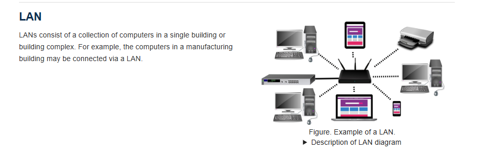
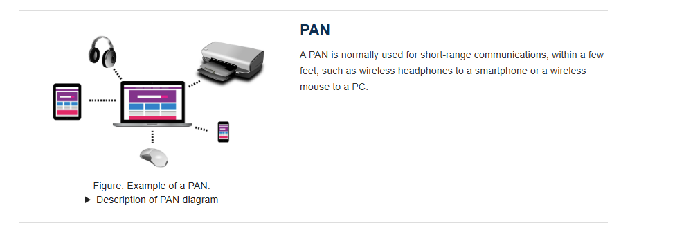
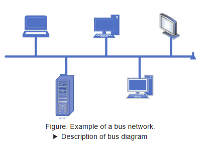
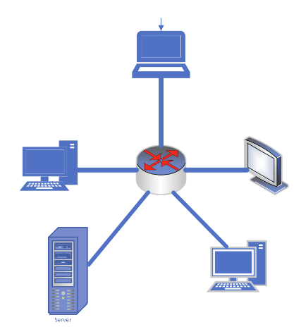
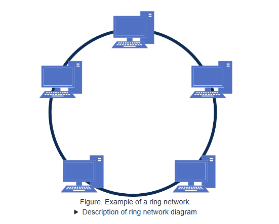
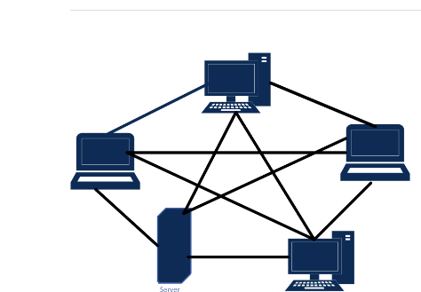

## Network Types
    networks are commonly classified based on the physical distance between components. According to this classification, there are three major categories of newtorks. Personal area network (pan), local area network (Lan), and wide area network (Wan)

## Bus
    Yet another classification of newtorks coinsider the topology of the network of the pattern in which the machines are connected. Four common topologies are bus, star, ring and mesh. Bus and star network topologies are the most common. In a bus network, the machines are connected to a common communication line called a bus.  the bus topology became popular in the 1990 when it was implemented under a set of standards/ protocals known as the eterernet. 

## Star
    Star networks have a single machine serving as a central point to which all others are connected. The star topology has roots as far back asa the 1970 when it evolved from the idea of a large gentral computer system servicing many users at once. the star topology is used today in wireless networks where communication is carried out via radio broadcast to a central machine called the acces point (AP)

## Ring
    Ring Topologies connect directly to each other as a peer.

## Mesh
    Mesh connects every device in a network to every other device. mesh networks enable redundancy while also introducing significantly more network traffic
    alternatively, a network could use a hybrid of these topologies. 
