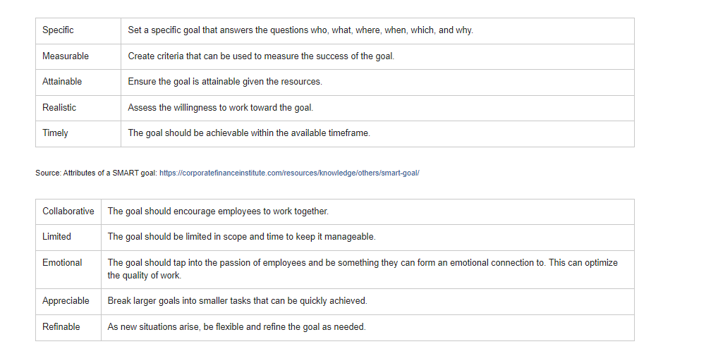
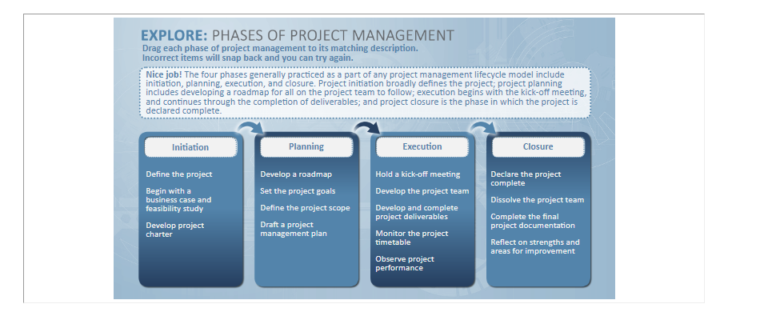

## System Maintenance
    the system is monitored, evaluated and modified as needed. System maintencance is a continuous phase that covers a wide varity of activites, including troubleshooting application errors and incompatibilities, updated documentation and providing end-user support

## Corrective Maintenance
    the goal is to remove errors to ensure functiionality of the system.

## Adaptive Maintenance
    is performed when organizatinal changes affect system requirements, such as changes in the organizational procedures, forms or system controls and security needs. 

## Perfective Maintenance 
    is performed when new compnents are introduced, or existing components are improved, to enhance overall system performance, 

## Preventive Maintenance
    refers to chagnes made to increase the life span of systems and could include restrucuring optimizing code, or updating documentation that impacts the scalability, stability and maintainability of the system.  example testing air conditioning units in a server room 

## Testing
    Methodologies that fall within the black-box category are alpha, beta and user acceptance testing. In alpha testing, the first stage, developers and/or an internal UX team test a preliminary version of the software, providing feedback about performance and functionality. The second stage is beta testing, sometimes referred to as pilot testing. In this stage, the next version of the system is given to a segment of end users for similar testing from their perspective before the final version is released. The final stage is referred to as user acceptance testing. During this stage, the users test the system in an operational setting to make sure the system continues to align with business objectives and meet the goals of the stakeholders.

## Project Initiation
    Project iniitiation broadly defines the project, it usually begins with a businesscase, followed by a feasbility study. durin the feastibility study, research assessess wether the business case will lead to reasonable, feasible solution. Project stakeholders provide input in the analysis of the business case, resulting in a project charter, or project initiation document, that outlines the business needs, the stake holder and the business case. 

## Project Planning
    poject planning includes developing a road map that everyone follow. this phase starts with setting the project goals, commonly using the smart or clear frameworks, both of which are described below. 

##  Project Execution 
    During project execution, project deliverables are developed and completed. A kickoff meeting usually marks the start of this phase. Tasks typically include developing the project team, assigning resources, setting up tracking systems, conducting status meetings, and monitoring the project timetable.
    Project performance is constantly observed during the execution phase. key performance indicators, or metrics are used to monitor the progress of the project, determining whether the project is on track to  meet the defined milestones. 

## Project Closure
    at the project closure phase, the project is declared complete and the project team is dissolved. Project managers complete the final project documentation, including financial reports. Generally, meeting are also a part of this phase, allowing members of the project team to reflect on strengths and oppertunities for improvement. 

## Risks in execution 
    tpically revolve around budget, people technology, equipment and stakeholder support, issues that can deem a project unsuccessful include cost overrun, insufficient staff, inaqequate tools to support the project, and lack of support from project stakeholder. planning in advance is one of the best ways to mitigate risks of execution. 

## Phases of Project Management

